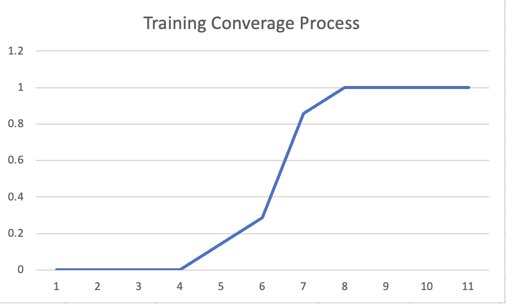
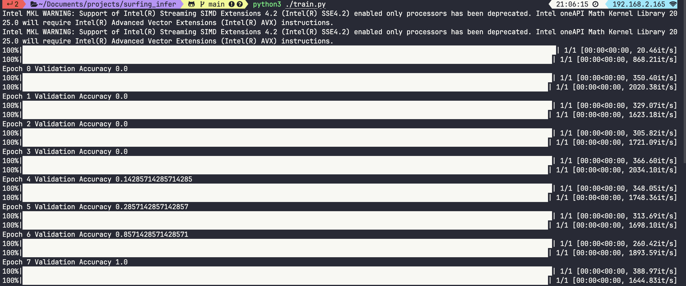

# 

## Breif

A machine learing model to predict whether the wave condition is suitable for novice surfer to surf.

## Usage

1. the dataset is within `dataset.json`

2. to start training, run:

```bash
# install pytorch on MacOS
conda install pytorch::pytorch torchvision torchaudio -c pytorch

python3 ./train.py
```

3. running result:




